# Decentraland Awesome Repository

Welcome to the Decentraland Awesome repository!

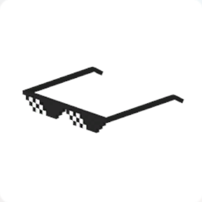

Here you can find content to help you build scenes for Decentraland. Here you'll find links to:

- [Examples](#Examples)
- [Libraries](#Libraries)
- [Tutorials](#Tutorials)
- [FAQs](#FAQs)

If you can think of an example that is easy to understand and covers valuable topics that aren't covered here, you're encouraged to create a **Pull Request** and [contribute](https://github.com/decentraland-scenes/Awesome-Repository/blob/master/CONTRIBUTING.md)!

If something doesn’t work, please [file an issue](https://github.com/decentraland-scenes/Awesome-Repository/issues/new).

<!--
## FAQs

[Read the FAQs](https://github.com/decentraland-scenes/Awesome-Repository/blob/master/FAQ.md)

Check the Forum
Visit the Discord channel

-->

## Key Concepts

| Article                                                                                                             | Thumbnail                                           | Description                                                                                                                      |
| ------------------------------------------------------------------------------------------------------------------- | --------------------------------------------------- | -------------------------------------------------------------------------------------------------------------------------------- |
| [Introduction to Entities, Components & Systems](https://decentraland.org/blog/tutorials/intro-to-sdk-v5/)          | 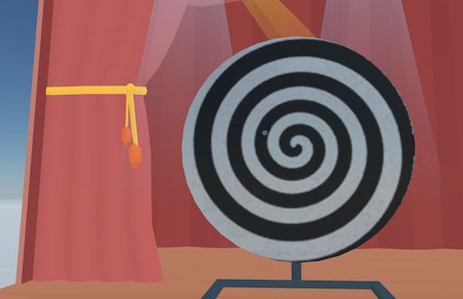 | A walkthrough that starts from scratch and covers most of the main ideas to understand: Entities, Components, Systems, and more. |
| [Motion & Animations - Part 1](https://decentraland.org/blog/tutorials/motion-animations-in-SDK-5/)                 | 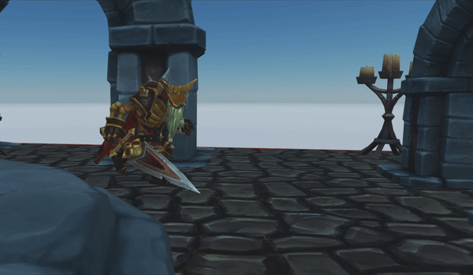      | A walkthrough that covers animating an entity and making it move to follow a path.                                               |
| [Motion & Animations - Part 2](https://decentraland.org/blog/tutorials/motion-animations-in-SDK-5-part-2/)          | 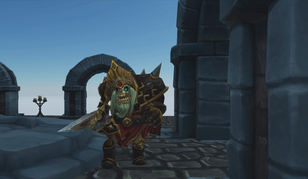       | Building up on the previous part, this part covers alternating animations, and responding to the player's proximity.             |

For a fully comprehensive introduction, we also recommend you read the following topics from the Documentation:

- [Entities & Components](https://docs.decentraland.org/development-guide/entities-components/)
- [Systems](https://docs.decentraland.org/development-guide/systems/)
- [Custom Components](https://docs.decentraland.org/development-guide/custom-components/)
- [Component Groups](https://docs.decentraland.org/development-guide/component-groups/)
- [Files in a Scene](https://docs.decentraland.org/development-guide/scene-files/)

See the [Decentraland documentation](docs.decentraland.org) to find more specific information about various other.

## Examples

### Essentials

| Example                                                                       | Thumbnail                                                  | Description                                                                                                                                                                                                                                         |
| ----------------------------------------------------------------------------- | ---------------------------------------------------------- | --------------------------------------------------------------------------------------------------------------------------------------------------------------------------------------------------------------------------------------------------- |
| [Sliding Door](https://github.com/decentraland-scenes/Sliding-door)           | 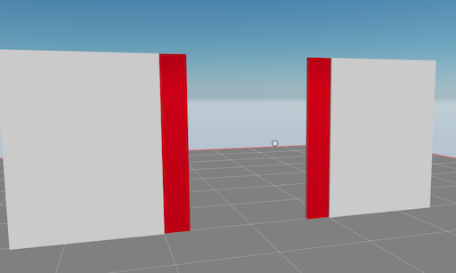       | Use the Utils library to shift the position of a door gradually. Clicks on the door toggle it from open to closed.                                                                                                                                  |
| [Door](https://github.com/decentraland-scenes/Open-door)                      | 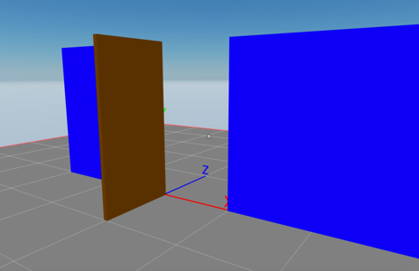               | Use the Utils library to rotate a door gradually. Clicks on the door toggle it from open to closed.                                                                                                                                                 |
| [Puffer](https://github.com/decentraland-scenes/Puffer)                       | 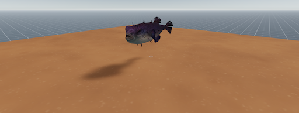             | Use the Utils library to scale items and delay actions. Also include 3D models and sounds.                                                                                                                                                          |
| [Button events](https://github.com/decentraland-scenes/Basic-Interactions)    | 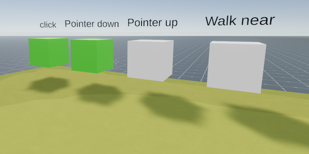 | A simple example of each way in which players can use button events to interact with the scene. Each shape's color is activated by interacting with it in a special way.                                                                            |
| [Jukebox](https://github.com/decentraland-scenes/Jukebox)                     | 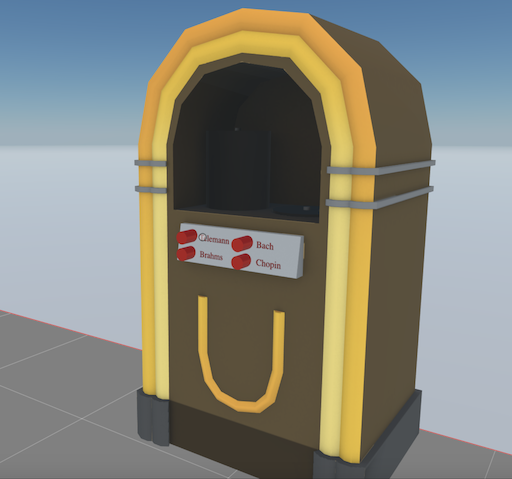            | Play different songs by pressing buttons on a jukebox.                                                                                                                                                                                              |
| [Hypno Wheels](https://github.com/decentraland-scenes/Hypno-wheels)           |         | A first encounter with Systems, Custom Components and Component Groups. Check out the [related tutorial](https://decentraland.org/blog/tutorials/intro-to-sdk-v5/).)                                                                                |
| [Shark Animation](https://github.com/decentraland-scenes/Shark-animation)     |     | Control animations on a 3D model. Toggle them on or off when clicking on the model.                                                                                                                                                                 |
| [Gnark Patrolling](https://github.com/decentraland-scenes/Gnark-patrol)       |               | A character walks along a fixed path, using lerp over each segment of the path. If you approach it, it will switch states to yelling at you. Check out the [related tutorial](https://decentraland.org/blog/tutorials/motion-animations-in-SDK-5/). |
| [Hummingbirds](https://github.com/decentraland-scenes/Hummingbirds)           | 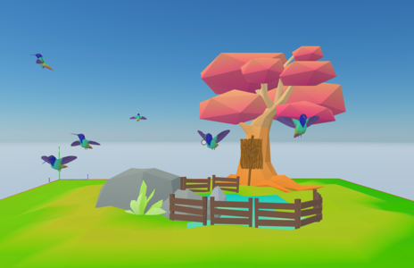       | A new bird spawns every time you click a tree. Each bird moves on its own to random positions.                                                                                                                                                      |
| [Smoke](https://github.com/decentraland-scenes/Smoke)                         | 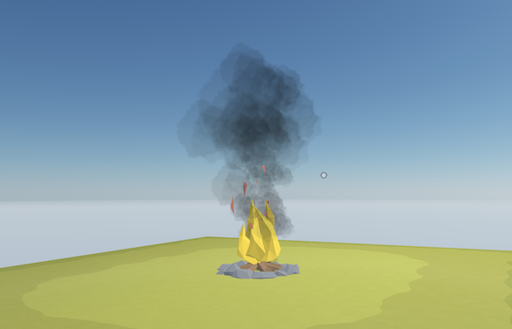              | Use planes to create a particle system that simulates smoke rising.                                                                                                                                                                                 |
| [Dance Floor](https://github.com/decentraland-scenes/Dance-floor)             | 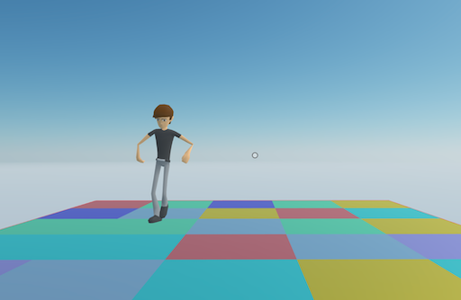         | Combines animations, sound, and tiles on the floor that randomly change color to the beat.                                                                                                                                                          |
| [Laser-Ray Casting](https://github.com/decentraland-scenes/Laser-ray-casting) |               | Use ray casting to trace a line in space and check for intersections. Cubes change material when hit by the laser. They also change when being pointed at by the player.                                                                            |
| [UV Map](https://github.com/decentraland-scenes/uv-map)                       | 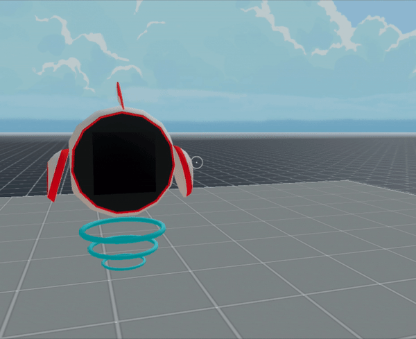                 | A simple scene that shows a spritesheet animation of a robot talking. The different expressions of the robot are all stored in the same image.                                                                            |
| [Swimming in Circles](https://github.com/decentraland-scenes/Swimming-shark)  | 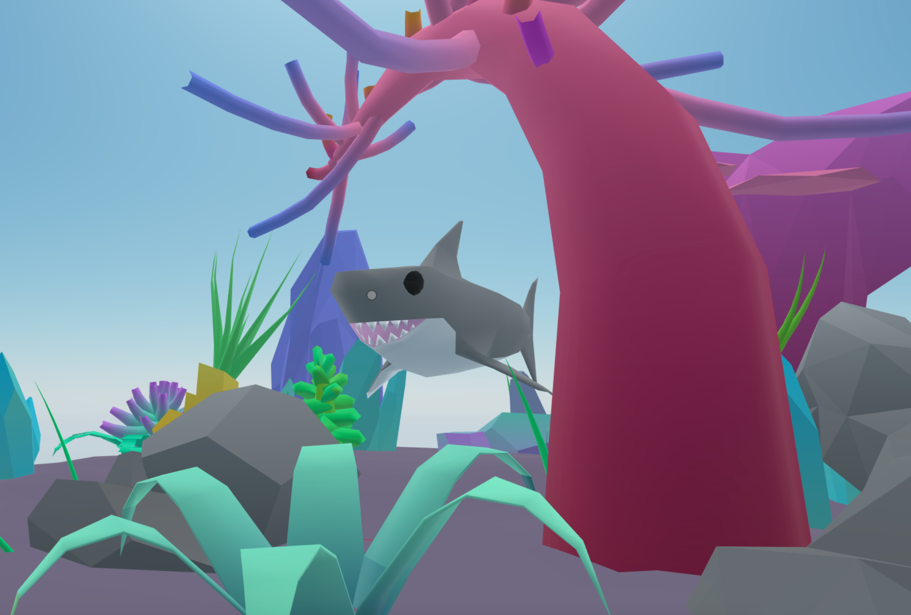     | Move a shark along the segments of a curve to swim in circles.                                                                                                                                                                                      |
| [Block Dog](https://github.com/decentraland-scenes/Block-dog)                 | 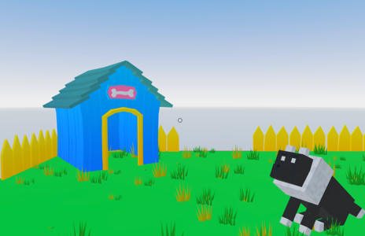           | A simple AI character that randomly chooses what action to take: follow you, sit or remain idle. Tell it to sit or stand up by clicking it, or tell it to drink water by clicking its bowl.                                                         |
| [Workspaces](https://github.com/decentraland-scenes/dcl-working-with-workspaces)                 | 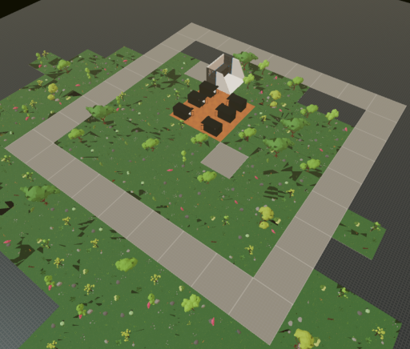           | Use workspaces to preview multiple adjacent scenes/portable experiences at onces and see how they interact.                                                  |

#### Game mechanics

| Example                                                                                    | Thumbnail                                                       | Description                                                                                                                                     |
| ------------------------------------------------------------------------------------------ | --------------------------------------------------------------- | ----------------------------------------------------------------------------------------------------------------------------------------------- |
| [Atari Arcade Cabinets](https://github.com/decentraland-scenes/atari-arcade-cabinets)      | 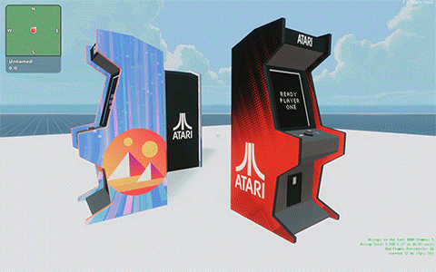   | Arcade cabinets containing variations of the classic Breakout game.                                                                             |
| [Avatar Swap](https://github.com/decentraland-scenes/avatar-swap)                          |              | Swapping out the default avatar for another character model.                                                                                    |
| [Beer Dispenser](https://github.com/decentraland-scenes/beer-dispenser)                    |           | A beer dispenser that uses P2P messaging so that you can pour beer for yourself and friends.                                                    |
| [Coconut Shy](https://github.com/decentraland-scenes/coconut-shy)                          |              | A coconut shy built using cannon.js physics engine.                                                                                             |
| [Coin Pickup](https://github.com/decentraland-scenes/coin-pickup)                          |              | Coins are picked up once the player walk over them.                                                                                             |
| [Enemy Spawner](https://github.com/decentraland-scenes/enemy-spawner)                      |            | Spawning enemy spaceships from various shaped portals.                                                                                          |
| [Grab Objects](https://github.com/decentraland-scenes/grab-objects)                        |             | Click an item to hold it and drop it somewhere else in the scene.                                                                               |
| [Grab Objects Advanced](https://github.com/decentraland-scenes/grab-objects-advanced)      |    | Click an item to hold it in the air and carry it or toss it around the scene using physics.                                                     |
| [Inflatable Punch Bag](https://github.com/decentraland-scenes/inflatable-punch-bag)        |     | An inflatable-punch-bag scene built using cannon.js physics engine.                                                                             |
| [Item Pickup](https://github.com/decentraland-scenes/item-pickup)                          |              | Various items like health packs and ammo that are picked up when players walk over them.                                                        |
| [Key Binding](https://github.com/decentraland-scenes/key-binding)                          |              | Using emote events as key bindings for switching between multiple paint colors, which can be expanded for something like weapon switching.      |
| [Light Bounce Puzzle](https://github.com/decentraland-scenes/light-bounce-puzzle)          |      | Reflecting a ray off of multiple objects at arbitrary angles.                                                                                   |
| [Mirror Puzzle](https://github.com/decentraland-scenes/mirror-puzzle)                      |            | A puzzle game where you reflect a beam of light to a target using a series of mirrors.                                                          |
| [Moving Platforms](https://github.com/decentraland-scenes/moving-platforms)                |         | A simple platformer that demonstrates various platform movements using code.                                                                    |
| [NPC Dialog](https://github.com/decentraland-scenes/npc-dialog-example-scene)              |               | A UI window presents texts from an NPC, allowing you to use Mouse Clicks, E and F keys to advance the conversation or answer questions.         |
| [Portal Puzzle](https://github.com/decentraland-scenes/portal-puzzle)                      |            | Using the new spawn feature to recreate a simple Portal clone.                                                                                  |
| [Power Cube](https://github.com/decentraland-scenes/power-cube)                            |               | Using simple planes to create a force field effect that blocks the player from reaching the access card.                                        |
| [Push Box Puzzle](https://github.com/decentraland-scenes/push-box-puzzle)                  |          | Based on the classic Sokoban puzzle game where you push statues onto marked spots.                                                              |
| [Random Noise Movement](https://github.com/decentraland-scenes/grass-noise-example)        |                    | Use noise generation to imitate the kind of randomness you see in nature.                                                                       |
| [Rocket Board](https://github.com/decentraland-scenes/rocket-board)                        |             | A rocket board that you can stand on and pilot. The board uses the cannon.js physics engine so you experience the momentum and inertia effects. |
| [Rotating Platforms](https://github.com/decentraland-scenes/rotating-platforms)            |       | A simple platformer that demonstrates rotating various platforms using code.                                                                    |
| [Shooting Range](https://github.com/decentraland-scenes/shooting-range)                    |           | Shoot at moving targets. Bullet holes appear in the spots where shots hit.                                                                      |
| [Shooting Range Advanced](https://github.com/decentraland-scenes/shooting-range-advanced)  |  | Shoot at moving targets. Bullet holes appear at whatever angle the bullet strikes the target.                                                   |
| [Splat Attack](https://github.com/decentraland-scenes/splat-attack)                        |             | Cover as much of the ground as you can with paint before calculating the area covered by it.                                                    |
| [Switchboard Platforms](https://github.com/decentraland-scenes/switchboard-platforms)      |    | A platform that moves when the player stands on one of the switches.                                                                            |
| [Tin Can Alley](https://github.com/decentraland-scenes/tin-can-alley)                      |            | A tin-can-alley scene built using cannon.js physics engine.                                                                                     |
| [Translocator](https://github.com/decentraland-scenes/translocator)                        | 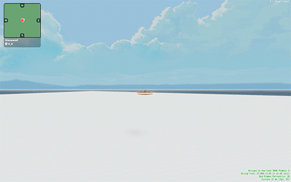            | Example of how to create a projectile with physics and combining that with the new spawn feature to create a translocator disc.                 |
| [Zombie Attack](https://github.com/decentraland-scenes/zombie-attack)                      |            | A zombie will chase you around and attack you once it gets near.                                                                                |
| [Block Smart Wearables](https://github.com/decentraland-scenes/block-portable-experiences) | 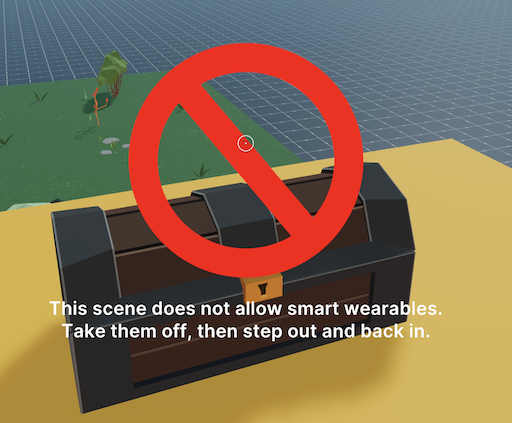          | Players wearing smart wearables are blocked from certain aspects of the scene, to prevent unfair advantages over others.                        |
| [uv projector](https://github.com/decentraland-scenes/uv-projector) |           |  Use UVs to map a video to multiple surfaces, constructing a single image that adjusts as the player changes their angle.                    |
| [Bird field](https://github.com/decentraland-scenes/bird-field) |           |  Control a flock of birds so that they each take off when you walk near. They can then land back on uneven terrain.                    |
| [Boolean Hole + Proximity Spheres](https://github.com/decentraland-scenes/boolean-hole-and-proximity-spheres) | 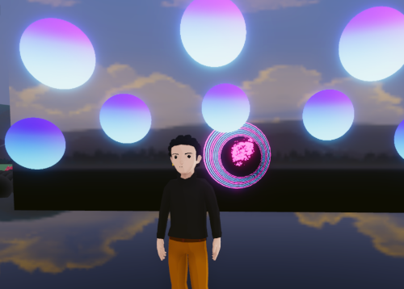          |  Demonstrates several objects that react to your proximity.  Simulates a Boolean Hole in a wall, has objects that move over/around you, triggers to activate effects inside or outside the building.                    |
| [Boid](https://github.com/decentraland-scenes/boids) |           |  Implementation of Boids.  Flock behavior of fish or birds                    |
| [NPC Tour Using A* Search Algorithm ](https://github.com/decentraland-scenes/npc-astar-search) | 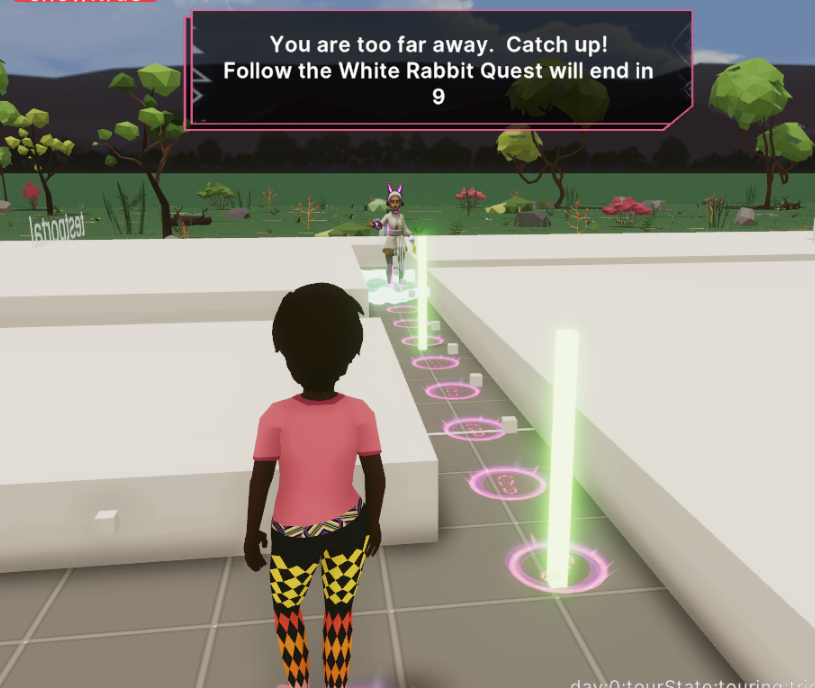          |  Use A* Search algorithm to help guide the NPC.                  |

#### Event hosting

| Example                                                                   | Thumbnail                                            | Description                                                                                                                     |
| ------------------------------------------------------------------------- | ---------------------------------------------------- | ------------------------------------------------------------------------------------------------------------------------------- |
| [Video Streaming](https://github.com/decentraland-scenes/video-streaming) | 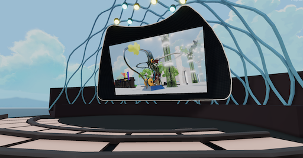        | A video streamed from an external URL. The repo includes instructions for various alternatives for uploading the video content. |
| [POAP Booth](https://github.com/decentraland-scenes/POAP-Booth)           | 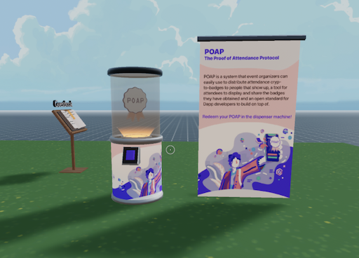         | Interact with the [POAP](https://www.poap.xyz/) contract to mint a POAP token when clicking on a booth.                         |
| [Digital Bouncer](https://github.com/decentraland-scenes/digital-bouncer) | 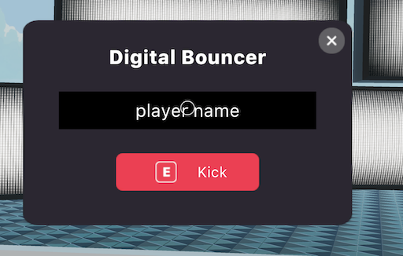      | Grant admin players special abilities, including kick other players out, and displaying UI announcements.                       |
| [Lazy Loading](https://github.com/decentraland-scenes/lazy-loading)       | 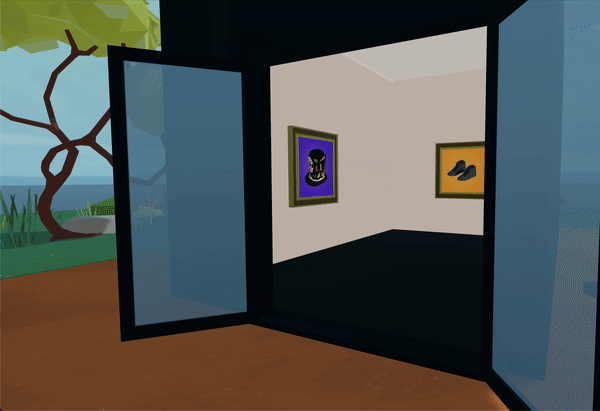 | Only load certain entities when the player walks into a room or region.                                                         |
| [Auto Dance Areas](https://github.com/decentraland-scenes/Auto-Dance-Area)       | 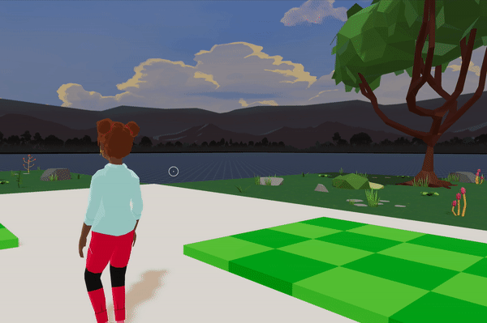 | Make players dance in a loop when they stand in certain areas of your scene.                                                      |
| [Show Management](https://github.com/decentraland-scenes/show-management)       | 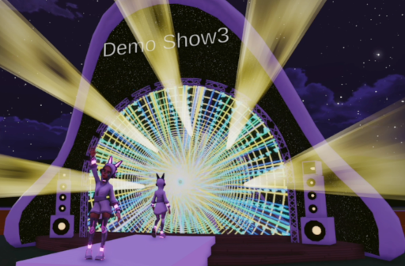 |  Schedule the start of a video, then sync the timing of actions in the scene to the video                      |
| [Green Screen](https://github.com/decentraland-scenes/greenScreen)                 | 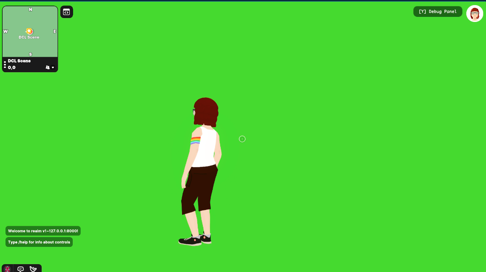           | A simple scene with a green screen that can be used for photoshoots. You can change the background color too.                                                  |
| [Video UV Mapping to Archways](https://github.com/decentraland-scenes/video-uv-mapping-to-archways) | 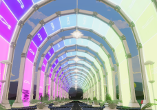          |  Demonstrates how to UV map a video texture onto many many planes                    |

#### Physics

| Example                                                                             | Thumbnail                                             | Description                                                                                     |
| ----------------------------------------------------------------------------------- | ----------------------------------------------------- | ----------------------------------------------------------------------------------------------- |
| [Bouncing Balls](https://github.com/decentraland-scenes/cannon-example-scene)       |          | Kick balls around and make them bounce off each other, using the cannon.js library for physics. |
| [Car + Physics](https://github.com/decentraland-scenes/cannon-car-example-scene)    | 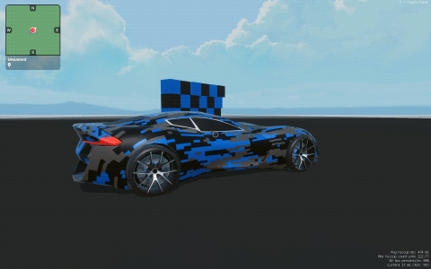    | Drive a car through piles of boxes and see them tumble down, using cannon.js for physics.       |
| [2D Bouncing Ball](https://github.com/decentraland-scenes/box2d-ball-example-scene) | 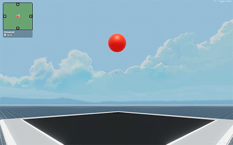 | A bouncing ball using the box2d physics library to simulate physics in a 2D space.              |

### Monetization & Blockchain

**Crypto libraries**

| Example                                                                       | Thumbnail                                                 | Description                                                                                                                         |
| ----------------------------------------------------------------------------- | --------------------------------------------------------- | ----------------------------------------------------------------------------------------------------------------------------------- |
| [Donation Box](https://github.com/decentraland-scenes/Donations-Box)          | 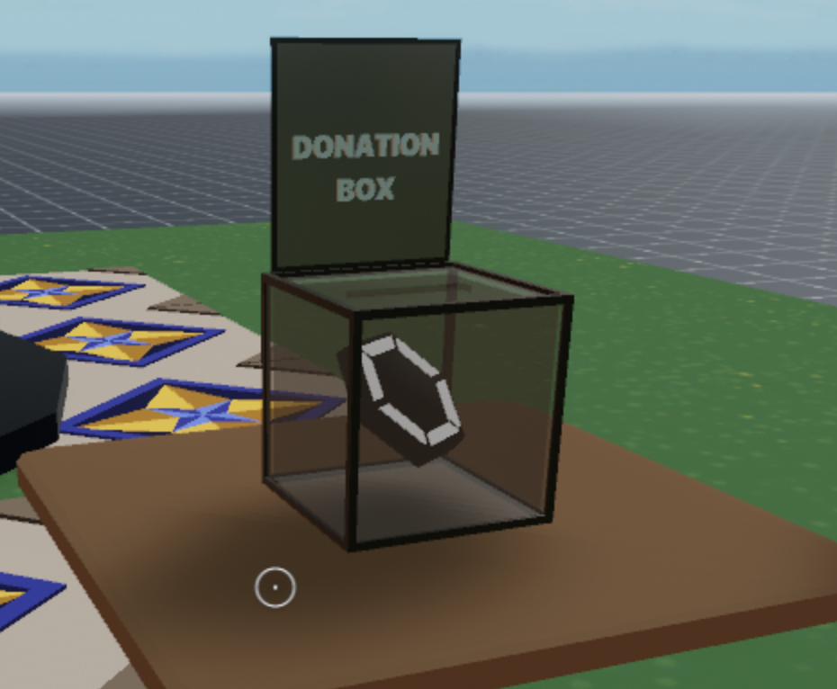         | Request MANA donations to a wallet.                                                                                                 |
| [NFT Scanner Basic](https://github.com/decentraland-scenes/nft-scanner-basic) |  | Checks whether the player owns a token from a particular smart contract before granting them permission to enter the club.          |
| [DCL Access](https://github.com/decentraland-scenes/dcl-access-library)       | 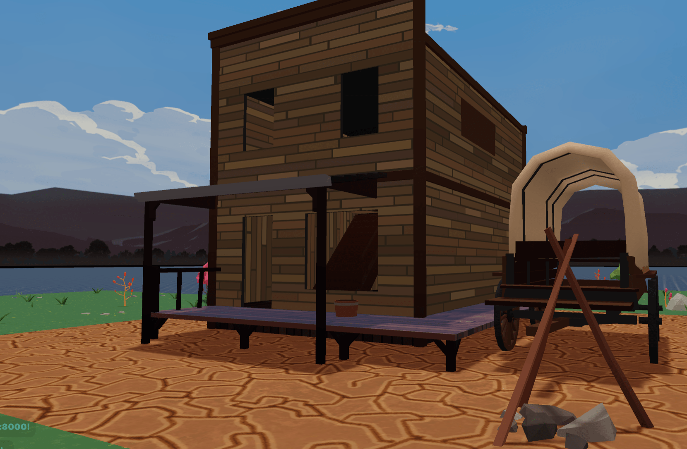 |  Check for token or wearable ownership to easily control access to a scene area                    |
| [Paid Button](https://github.com/decentraland-scenes/Paid-Button)             | 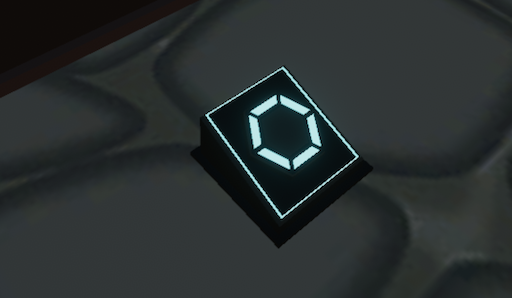       | Add a button that is only activated by paying a MANA sum to a specified address.                                                    |
| [Paid Lever](https://github.com/decentraland-scenes/Paid-Lever)               | 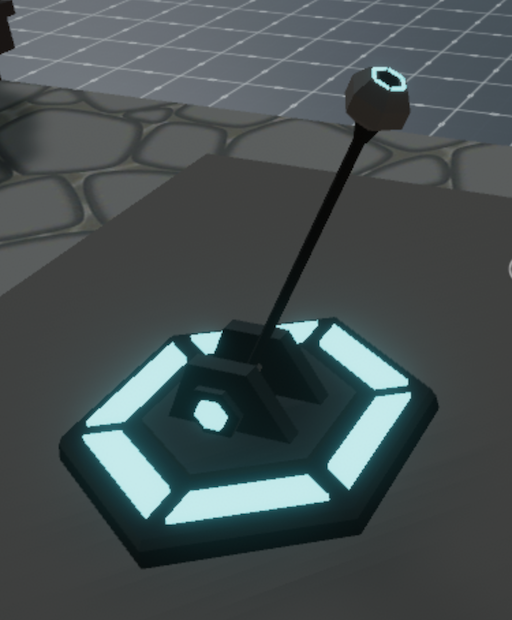        | Add a lever that only switches state by paying a MANA sum to a specified address.                                                   |
| [Wearables Scanner](https://github.com/decentraland-scenes/wearables-scanner) |            | Fetch the list of wearables that a player currently has on. If they have something in the eyewear category, open the door for them. |
| [Wearables Store](https://github.com/decentraland-scenes/wearables-store)     |     | Display all wearables on sale on L2 and purchase them in-world. You can also configure it to only display certain collections.      |

**NFTs**

| Example                                                                    | Thumbnail                                             | Description                                                                                                    |
| -------------------------------------------------------------------------- | ----------------------------------------------------- | -------------------------------------------------------------------------------------------------------------- |
| [Simple NFT](https://github.com/decentraland-scenes/Certified-criptokitty) | 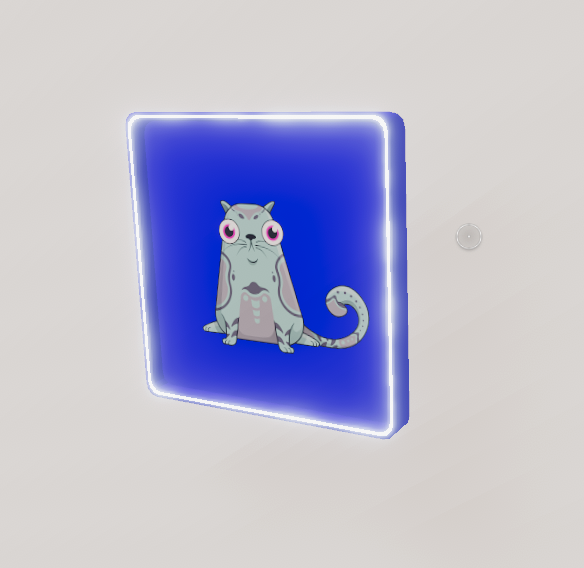         | Display a 2D NFT in a picture frame.                                                                           |
| [NFT Wall](https://github.com/decentraland-scenes/nft-wall-example-scene)  |  | Display a collection of 2D NFTs in picture frames, these swap every few seconds, taking data from a JSON file. |

**Interact directly with contract**

<!-- mana transaction?? -->

| Example                                                                        | Thumbnail                                          | Description                                                                                                         |
| ------------------------------------------------------------------------------ | -------------------------------------------------- | ------------------------------------------------------------------------------------------------------------------- |
| [MANA Burning](https://github.com/decentraland-scenes/MANA-Burning-Altar)      | 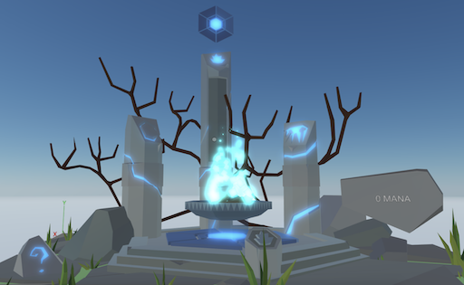 | Interact with the MANA contract to burn MANA fees collected over time by the Market place in a ceremonious way.     |
| [Mint Pixelchain NFT](https://github.com/decentraland/pixel-chain-mural-scene) | 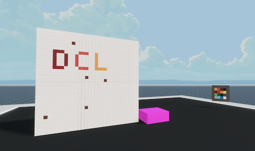 | Paint a mural made from 32 x 32 pixels. You can then mint the image as a [PixelChain](https://pixelchain.art/) NFT. |

### Multiplayer & APIs

#### Hit an API

| Example                                                                         | Thumbnail                                          | Description                                                                                                                                                                                                   |
| ------------------------------------------------------------------------------- | -------------------------------------------------- | ------------------------------------------------------------------------------------------------------------------------------------------------------------------------------------------------------------- |
| [Party Time](https://github.com/decentraland-scenes/Party-Time)                 | 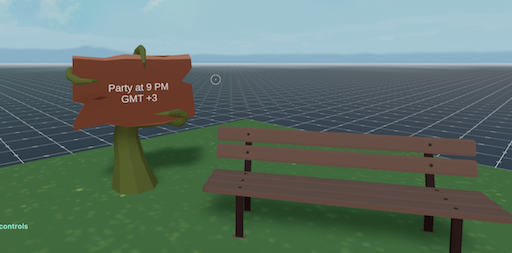 | Hit a world clock API to check the time, start a party if it's after 9PM.                                                                                                                                     |
| [DCL Trams](https://github.com/decentraland-scenes/DCL-trams)                   | 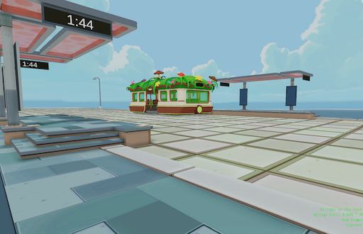      | Hit a world clock API to sync the position of a tram line, so all players see them on the same location. Each tram does a full loop every 3 minutes, basing its position on every frame relative to the time. |
| [Events API](https://github.com/decentraland-scenes/Events-API)                 | 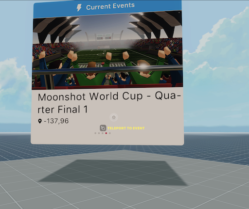     | Query the Decentraland Events API for any events that are currently active to display their info. If more than one, flip through them on the display.                                                         |
| [Weather Simulation](https://github.com/decentraland-scenes/Weather-simulation) | 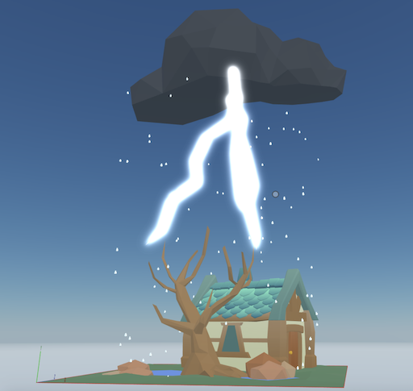    | Check a weather API, then represent the weather conditions, whatever they are.                                                                                                                                |

#### Run server-side validations

| Example                                                                                             | Thumbnail                                            | Description                                                                                                                                                                             |
| --------------------------------------------------------------------------------------------------- | ---------------------------------------------------- | --------------------------------------------------------------------------------------------------------------------------------------------------------------------------------------- |
| [Validate Player Authenticity](https://github.com/decentraland-scenes/validate-player-authenticity) | 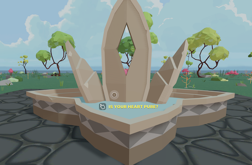 | Hit a server that validates that the player really is in Decentraland, in a specific parcel, with a recent time-stamp, and signed a message cryptographically with their ephemeral key. |

#### Use message bus

| Example                                                                         | Thumbnail                                           | Description                                                                                                                                   |
| ------------------------------------------------------------------------------- | --------------------------------------------------- | --------------------------------------------------------------------------------------------------------------------------------------------- |
| [Block Fountain](https://github.com/decentraland-scenes/Block-Fountain)         | 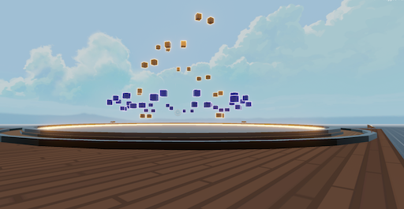    | The cubes in this fountain have several animations that each set can play. When a player pushes a button, all players see the same animation. |
| [Clap Meter](https://github.com/decentraland-scenes/clap-meter)                 | 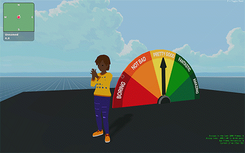  | A meter that goes up based on the number of claps from players applauding in the scene.                                                       |
| [Piano Floor](https://github.com/decentraland-scenes/piano-floor-example-scene) |  | Play the keys of this piano by stepping on them. All players will hear the notes that are played.                                             |

#### Use an API as DB

| Example                                                                          | Thumbnail                                           | Description                                                                                                                           |
| -------------------------------------------------------------------------------- | --------------------------------------------------- | ------------------------------------------------------------------------------------------------------------------------------------- |
| [Leader Board](https://github.com/decentraland-scenes/Leader-Board)              | 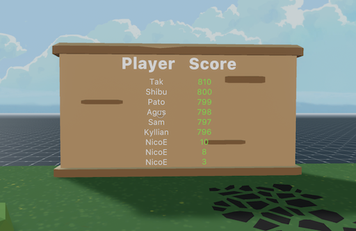 | Upload player's final scores to a server, the best ones are displayed for all to see on a board.                                      |
| [Guest Book API](https://github.com/decentraland-scenes/Guest-Book-API)          | 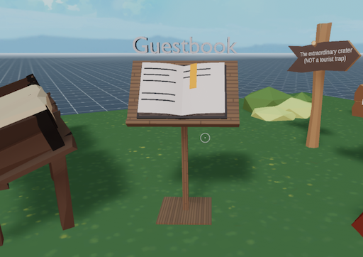   | Players that sign this guest-book upload their user name and address to the server. All signatures are fetched when opening the book. |
| [Pixel Mural](https://github.com/decentraland-scenes/mural-example-scene)        | 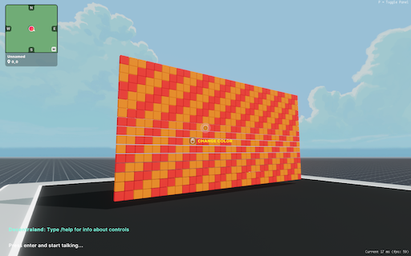       | Create 2D pixel art by painting tiles. Players are synced through both the messagebus and a DB in a server.                           |
| [3D Voxel Art Creator](https://github.com/decentraland-scenes/voxel-art-creator) | 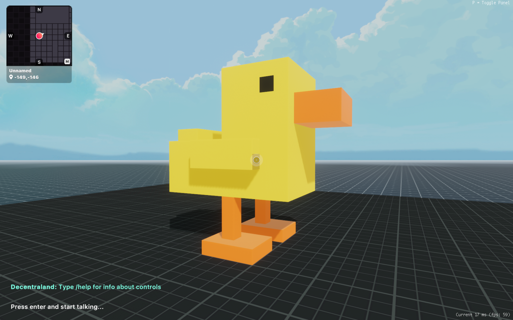       | Create 3D voxel art by placing cubes in place. Players are synced through both the messagebus and a DB in a server.                   |
| [Zenquencer](https://github.com/decentraland-scenes/Zenquencer)                  |   | Create musical patterns that are played in sequence. Players are synced through both the messagebus and a DB in a server.             |

#### Plain WebSockets

| Example                                                                           | Thumbnail                                        | Description                                                                                                                                                                                   |
| --------------------------------------------------------------------------------- | ------------------------------------------------ | --------------------------------------------------------------------------------------------------------------------------------------------------------------------------------------------- |
| [Broadcast Server](https://github.com/decentraland-scenes/ws-broadcast)           | (server code only)                               | A basic server that broadcasts all messages it receives to all other players in a room.                                                                                                       |
| [Color Switch](https://github.com/decentraland-scenes/ws-example)                 | 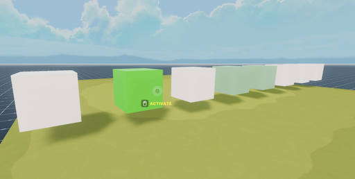 | A minimal scene where clicking on cubes changes their color. The broadcast server syncs these changes to all other players in the same realm.                                                 |
| [Bouncing Balls](https://github.com/decentraland-scenes/websocket-bouncing-balls) |     | Each player runs physics client side. Websockets sends information about new forces applied to the entities. The broadcast server syncs these changes to all other players in the same realm. |
| [Frisbee Throwing](https://github.com/decentraland-scenes/websocket-frisbee)      |   | Each player runs physics client side. Websockets sends information about the throwing of the frisbee. The frisbee is hidden when picked up by a player.                                       |
| [Basketball](https://github.com/decentraland-scenes/websocket-basket)             | 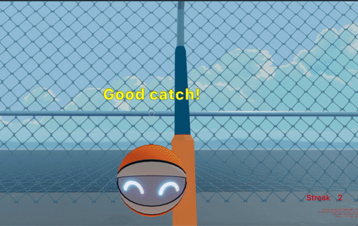   | Each player runs physics client side. Websockets sends information about the throwing of the ball. The ball is hidden when picked up by a player.                                             |
| [Discord Chat](https://github.com/decentraland-scenes/discordWebsocket)           |                                                  | Display messages being posted to Decentraland discord server in real time inside the world                                                                                                    |

#### Colyseus

| Example                                                                       | Thumbnail                                                 | Description                                                                                                                                                                           |
| ----------------------------------------------------------------------------- | --------------------------------------------------------- | ------------------------------------------------------------------------------------------------------------------------------------------------------------------------------------- |
| [Cube Jumper](https://github.com/colyseus/decentraland)                       |           | A basic server that broadcasts all messages it receives to all other players in a room.                                                                                               |
| [Land Flipper Game](https://github.com/decentraland-scenes/Land-Flipper-Game) |  | A team game for 2 players or more, where tiles switch colors when walked on. The server keeps track of the game's state, and has the final word about when the game ends and who won. |
| [Space Traitor](https://github.com/decentraland-scenes/Space-Traitor)         | 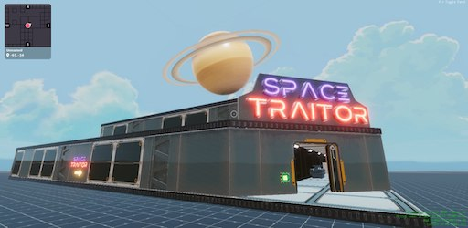          | A game of deceit and secret identities. One player is randomly assigned as the trator, that will work against the others to sabotage the space ship.                                  |
| [OSC Relay](https://github.com/decentraland-scenes/osc-relay)                 | 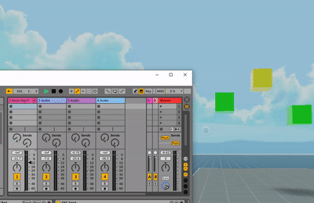      | Listen to OSC messages from any source, relay them to affect Decentraland scenes in real time via a Colyseus server.                                                                  |

### Full scenes

| Example                                                                                                   | Thumbnail                                                 | Description                                                                                                                                                                          |
| --------------------------------------------------------------------------------------------------------- | --------------------------------------------------------- | ------------------------------------------------------------------------------------------------------------------------------------------------------------------------------------ |
| [Crypto Valley Conference Center](https://github.com/decentraland-scenes/crypto-valley-conference-center) |  | A fully equipeped venue ready for live events, with video streaming and POAP dispenser.                                                                                              |
| [White Rabbit Night Club](https://github.com/decentraland-scenes/white-rabbit)                            |             | A 24/7 nightclub, with lights and smoke effects, arcade machines, and much more.                                                                                                     |
| [Default Museum](https://github.com/decentraland-scenes/museum_template)                            | 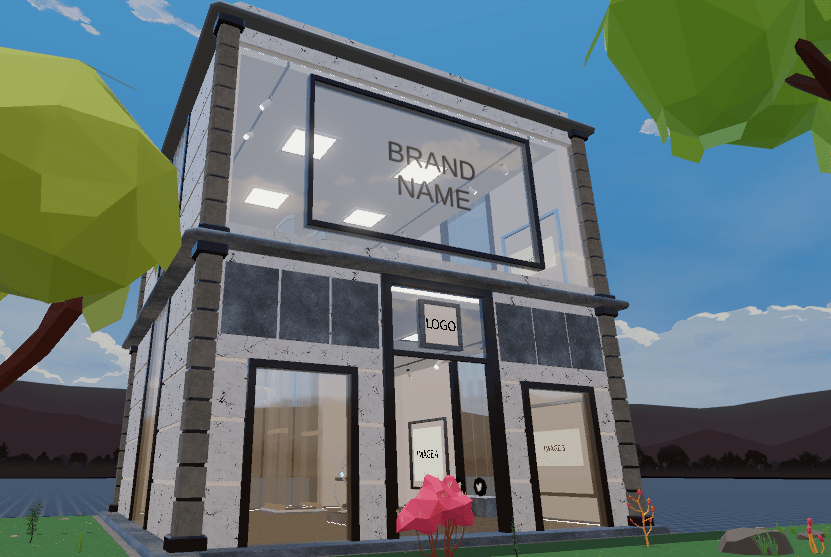            | A simple generic museum to display NFT art and a few common additional features.                                                                                                   |
| [Default Wearables Store](https://github.com/decentraland-scenes/store-template)                            | 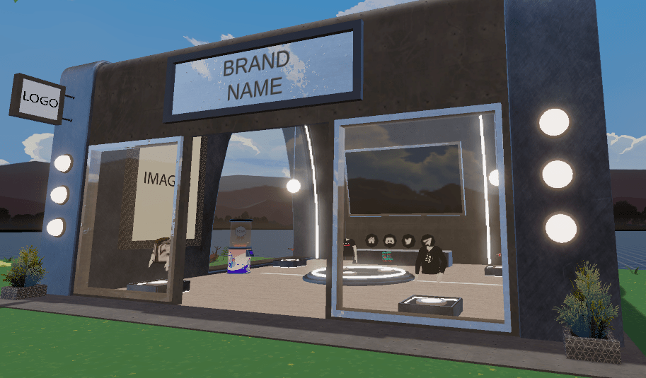            | A simple generic store to sell wearables, with a few common additional features.                                                                                                     |
| [Genesis Plaza](https://github.com/decentraland-scenes/Genesis-Plaza)                                     | 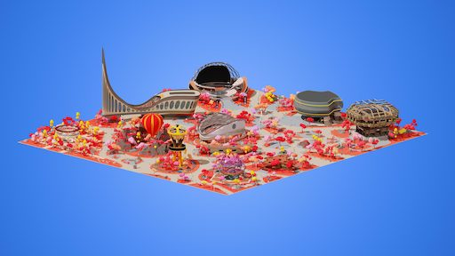           | The full code used in Genesis Plaza (0,0), including all the interactive elements found there.                                                                                       |
| [Soho Plaza](https://github.com/decentraland-scenes/Soho-Plaza)                                           | 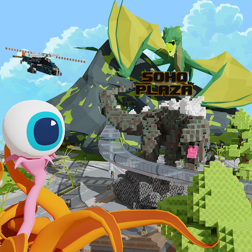              | The full code used in Soho Plaza (-75,0), including all the interactive elements found there.                                                                                        |
| [Escape Room Tutorial](https://github.com/decentraland-scenes/dcl-escape-room-tutorial)                   | 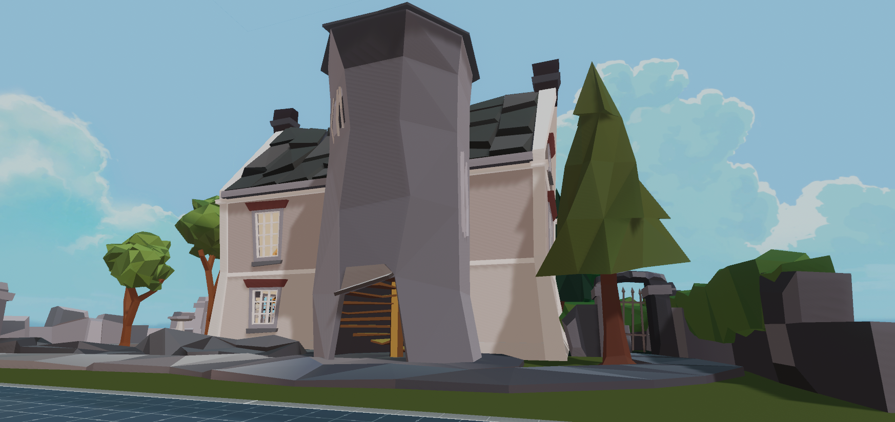       | An escape room full of puzzles to solve. A [video tutorial series](https://hardlydifficult.github.io/dcl-escape-room-tutorial/) covers how to make it, starting from the essentials. |
| [Castaway 2048](https://github.com/decentraland-scenes/Castaway-2048)                                     | 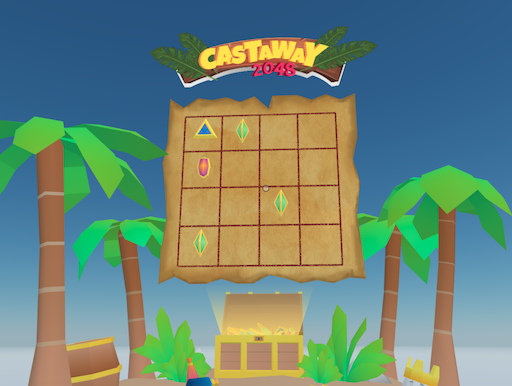              | A puzzle game based on 2048, where you merge similar gems into valuable ones, till you reach the value of 2048.   |
| [DecentRally](https://github.com/decentraland-scenes/decentrally)                                         | 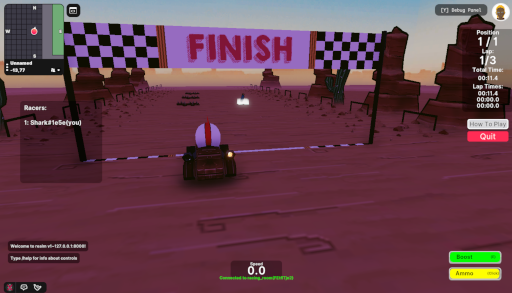| A racing game that shows what the Infinity Engine code can do.                                                                      |
| [MVMF 2022 Main Stage](https://github.com/decentraland-scenes/metaverse-festival22-main-stage)                                         | 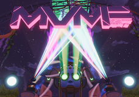| Assets and code used for the Metaverse Music Festival (MVMF) 2022 Main Stage Scene                                                                      |
| [MVMF 2022 Tower of Babel](https://github.com/decentraland-scenes/metaverse-festival22-tower-of-babel)                                         | 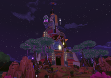| Assets and code used for the Metaverse Music Festival (MVMF) 2022 Tower of Babel Scene                                                                    |
| [Snowball Arena](https://github.com/decentraland-scenes/metaverse-festival22-tower-of-babel)                                         | 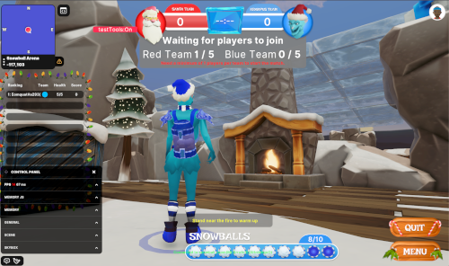| Multiplayer Snowball Fight Arena                                                                    |

#### Community Modules

| Example                                                                       | Thumbnail                                                 | Description                                                                                                                                                                           |
| ----------------------------------------------------------------------------- | --------------------------------------------------------- | ------------------------------------------------------------------------------------------------------------------------------------------------------------------------------------- |
| [Checkers Module](https://github.com/TheCryptoTrader69/Decentraland_Checkers)                     | 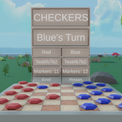      | Two player game of checkers, with fully outlined peer-to-peer networking. |
| [NFT Gallery Module](https://github.com/TheCryptoTrader69/Decentraland_Gallery)            | 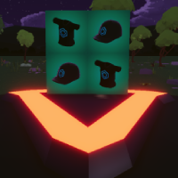            | Provides easy-to-use interfaces to generate NFT (2D and 3D) displays. By simply editing the JSON files a user can quickly add displays to their scene. |
| [Parkour Creation Kit](https://github.com/TheCryptoTrader69/Decentraland_ParkourKit)       | 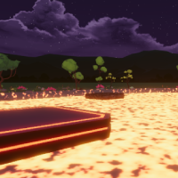            | Provides all the tools need to create your own parkour stadium. Includes: multiple platform types, collectibles, traps, checkpoint/respawn mechanics. |
| [Card Game Creation Kit](https://github.com/TheCryptoTrader69/Decentraland_CardGameKit)    | 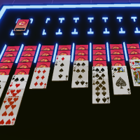           | Provides all the utilities required to create card games in Decentraland. Also comes pre-packed with several card games that act as functional examples! |  |

### Game jam winners

You can access the code submitted by previous game jam competitions, for those scenes that creators chose to make open source.

- [May/June 2022](https://github.com/decentraland-scenes/Awesome-Repository/blob/master/game-jam-2022.md)

## Libraries

| Article                                                                                     | Description                                                                                                                                                                                                                                                                                         |
| ------------------------------------------------------------------------------------------- | --------------------------------------------------------------------------------------------------------------------------------------------------------------------------------------------------------------------------------------------------------------------------------------------------- |
| [ECS Utils](https://github.com/decentraland/decentraland-ecs-utils)                         | A very handy collection of common tasks made simple. Gradually move, rotate or scale over time. Add trigger areas, delay an action, run an event periodically, and more!.                                                                                                                           |
| [UI Utils](https://github.com/decentraland/decentraland-ui-utils)                           | UI Prefab components and functions for common game UI elements. Show health-bars, labels, counters, icons, prompt windows, NPC dialogs                                                                                                                                                              |
| [NPC Utils](https://github.com/decentraland/decentraland-npc-utils)                         | Tools to easily create non-player characters (NPCs) that you can have a conversation with. They can ask quesions, play animations, turn around to always face the player, etc                                                                                                                       |
| [Crypto Utils](https://github.com/decentraland/decentraland-crypto-utils)                   | Several functions to allow you to easily carry out operations with MANA, other currencies, NFTs, the Marketplace, sign messages or anything that involves smart contracts.                                                                                                                          |
| [L2 Utils](https://github.com/decentraland/decentraland-l2-utils)                           | Several functions to allow you to easily carry out operations with MANA in a Layer 2 Ethereum network, with significantly reduced gas fees and transaction delays.                                                                                                                                  |
| [DCL Access Area](https://github.com/lastraum/dcl-access-area)                           | Several functions to easily controll player acccess to an area in the scene, based on ownership of tokens, wearables or allowlist of player IDs.                                                                                                                                  |
| [Authentication Middleware](https://github.com/decentraland/decentraland-crypto-middleware) | To use on servers that interact with Decentraland scenes, to validate that a request truly comes from a real player that is in fact in Decentraland.                                                                                                                                                |
| [Scene Object Model (SOM)](https://github.com/rdixon22/som-dcl)                             | A Scene Object Model (SOM) file lists all of the GLTF or GLB models to load into a Decentraland scene. This module contains a SceneObject data structure used to define the models and their positioning in the world, and a ModelLoader class that handles the loading and positioning at runtime. |
| [Noise Utils](https://github.com/decentraland/decentraland-noise-utils)                     | Tools for generating semi-random noise based on the Perlin and Simplex algorithms. These generate random sequences of values similar to the kind of randomness seen in nature.                                                                                                                      |
| [DCLDash](https://github.com/pmacom/dcldash)                     | A suite of entities, debug utilities and helper functions that will speed up your decentraland SDK development. |
| [Show Management](https://github.com/decentraland/show-management)                     | A set of tools for managing the playing of videos and video playlists, together with synchronized events in the scnene like animations. It reads subtitle-like instructions with time-stamps to match timing with the video. |

> Note: To update these libraries from versions older than February 9th 2021, see the [migration guide](https://github.com/decentraland-scenes/Awesome-Repository/blob/master/lib-migration-guide.md)

<!--
crypto library
MATIC library

physics??
 -->

## Tutorials

### Video tutorials

Find a full playlist of all Decentraland video tutorials here:

[Youtube Playlist](https://www.youtube.com/playlist?list=PLAcRraQmr_GPi-8qgv17ewdGl50OHuOhH)

### Escape Room Video Tutorial Series

This series of 5 minute videos covers a number of essential concepts, game mechanics and coding best practices. They take you through the whole process of building a full escape room game.

[See the videos](https://hardlydifficult.github.io/dcl-escape-room-tutorial/)

> Tip: The videos are presented in the above link together with written accompanying content, including all the code in case you want to copy and paste parts of it.

The full code from the tutorial is available in this [repository](https://github.com/HardlyDifficult/dcl-escape-room-tutorial).

### Multiplayer & APIs

| Article                                                                     | Description                                                                                        |
| --------------------------------------------------------------------------- | -------------------------------------------------------------------------------------------------- |
| [Servers - Part 1](https://decentraland.org/blog/tutorials/servers-part-1/) | Send requests to an API to fetch data.                                                             |
| [Servers - Part 2](https://decentraland.org/blog/tutorials/servers-part-2/) | Launch your own server on Firebase to handle HTTP requests from your scene and store data in a DB. |
| [Servers - Part 3](https://decentraland.org/blog/tutorials/servers-part-3/) | Build a WebSockets server to handle real-time updates.                                             |

### Other

| Article                                                                                                   | Description                                                                                                                                    |
| --------------------------------------------------------------------------------------------------------- | ---------------------------------------------------------------------------------------------------------------------------------------------- |
| [Creating Genesis Plaza - Part 1](https://decentraland.org/blog/tutorials/creating-genesis-plaza-part-1/) | Tips and tricks that went into the creation of Genesis Plaza, regarding best practices and optimization.                                       |
| [Creating Genesis Plaza - Part 2](https://decentraland.org/blog/tutorials/creator-genesis-plaza-part-2/)  | Guidance about several features that were first introduced with Genesis Plaza, like video and audio streaming, teleports, external links, etc. |
| [Creating Salmonomicon](https://decentraland.org/blog/tutorials/behind-the-scenes-with-salmonomicon/)     | Tips and tricks that went into the creation of Salmonomicon (-50,0). Mostly related to UI and ray casting.                                     |

### Guest Posts

| Article                                                                                                                                            | Description                                                                                               |
| -------------------------------------------------------------------------------------------------------------------------------------------------- | --------------------------------------------------------------------------------------------------------- |
| [Using the UI](https://decentraland.org/blog/tutorials/adding-a-ui/)                                                                               | A walkthrough by Surz about how to create a UI for your scene.                                            |
| [Picking & Moving Objects](https://decentraland.org/blog/announcements/building-blocks/)                                                           | A walkthrough by Interweaver about how to pick up objects and place them in position, snapping to a grid. |
| [Sprite Animations](https://decentraland.org/blog/tutorials/creating-a-sprite-fire/)                                                               | A walkthrough by Brent Greyling about creating an animated fireplace using 2D sprite images.              |
| [Using the Blockchain - Part 1](https://www.decentral.games/blog/tutorial-1-setting-up-the-decentraland-environment-and-building-your-first-scene) | Part 1 in a series by Baus that goes from scene building essentials to using smart contracts.             |
| [Using the Blockchain - Part 2](https://www.decentral.games/blog/tutorial-2-using-custom-models-and-introduction-to-scripting)                     | Part 2 in a series by Baus that goes from scene building essentials to using smart contracts.             |
| [Using the Blockchain - Part 3](https://www.decentral.games/blog/decentral-games-tutorial-3-advanced-scripting-with-systems)                       | Part 3 in a series by Baus that goes from scene building essentials to using smart contracts.             |
| [Using the Blockchain - Part 4](https://www.decentral.games/blog/tutorial-4-using-the-ethereum-blockchain-in-your-scene)                           | Part 4 in a series by Baus that goes from scene building essentials to using smart contracts.             |
| [Placing Art NFTs](https://decentraland.org/blog/tutorials/placing-nft-art-into-a-scene/)                                                          | A walkthrough by Holodot about how to place NFT 2D art in a scene.                                        |

### 3D Modeling for Decentraland

| Video                                                                       | Description                                                                                                                                                 |
| --------------------------------------------------------------------------- | ----------------------------------------------------------------------------------------------------------------------------------------------------------- |
| [Add a collider](https://www.youtube.com/watch?v=UrByRRwfGjY)               | Add a collider to an existing 3D model, to prevent players from walking through it.                                                                         |
| [Add predefined animations](https://www.youtube.com/watch?v=7RSsBmm-rVs)    | Download a freely licenced 3D model and apply free animations that you can download from Mixamo to it.                                    |
| [Create animations in Blender](https://www.youtube.com/watch?v=eiHI-B5cH4k) | Download a freely licenced 3D model, import it into Blender and then create an _armature_ to manually create your own _animations_ for it. |

## Copyright info

All of these scenes are open source, protected with a standard Apache 2 licence. This licence states that this content can be used freely, even commercially, as long as you acknowledge the author. See the terms and conditions in the [LICENSE](/LICENSE) file.
